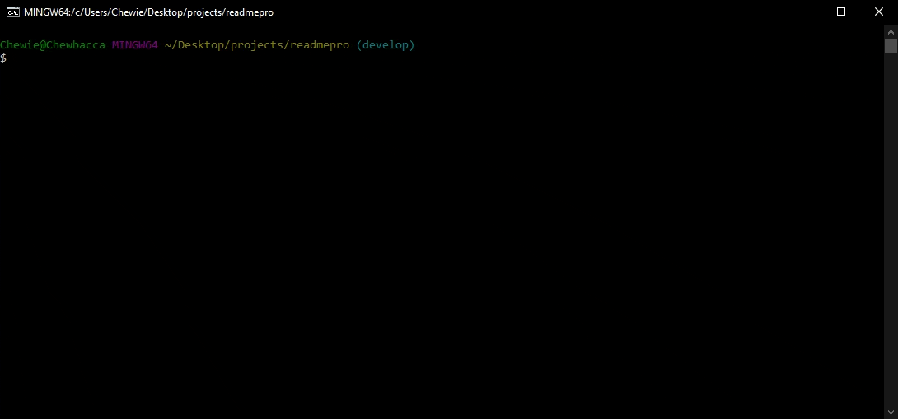

  # ReadMe Pro

  ## Table of Contents

  * [Description](#description)
  * [Installation](#installation)
  * [Demo](#demo)
  * [Technologies](#technologies)
  * [Contributions](#contributions)
  * [Additional Information](#additional-information)

  ## [Description:](#table-of-contents)
  ReadMe Pro is a simple command-line interface application that creates clean and professional ReadMe files for your next project. Dynamically creates a markdown text file using prompts from the Inquirer package from npm.
  
  *User Story:*
  ```
  AS a developer
  I WANT a README generator
  SO THAT I can quickly create a professional README for a new project
  ```

  ## [Installation:](#table-of-contents)
  To install the required dependencies, run the following command:
  ```
  npm i inquirer
  ```

  ## [Demo:](#table-of-contents)
  This application runs from the command line. After installing the required dependencies, run using the following command:
  ```
  node index.js
  ```
  

  Once completed, check the 'dist' folder for your new Readme!
  
  

  ## [Technologies:](#table-of-contents)
  Created using:
  * Node.js
  * Inquirer Package from NPM
  * License Badges and links from [lukas-h](https://gist.github.com/lukas-h/2a5d00690736b4c3a7ba#file-license-badges-md)

  ## [Contributions:](#table-of-contents)
  No contributors currently. Contributions more than welcome. If you are interested please contact me using the info [below](#additional-information)

  ## [Additional Information:](#table-of-contents)
  _If you have any questions about the application, have any notes, or would like to become a contributor, please feel free to contact me_
  
[GitHub](https://github.com/blindsweatyhansolo)